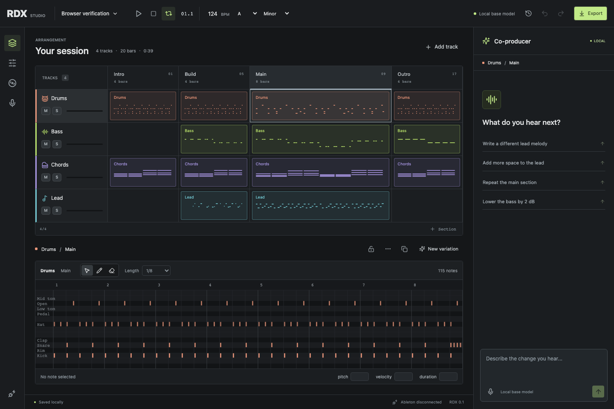
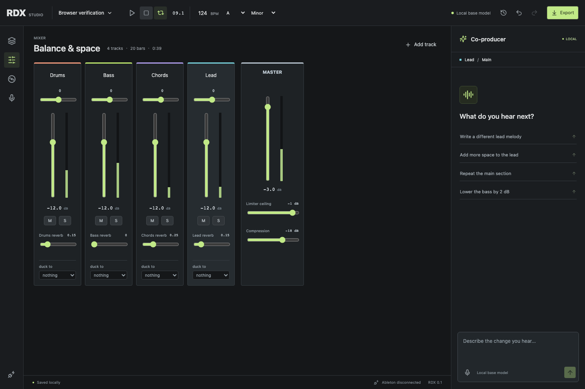
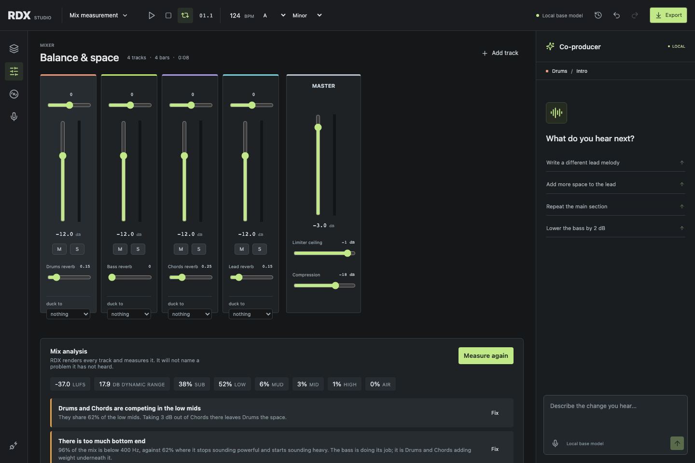

<div align="center">

# RDX

**A local AI co-producer for music. You describe how it should feel; it makes the edit and shows you exactly what it did.**

Runs entirely on your Mac. No cloud, no account, no telemetry.



</div>

---

Most music tools want parameter names. RDX wants sentences.

> *"The lead sounds too harsh, warm it up."*
> *"Give me a kick pattern with a double clap."*
> *"Sidechain the pads to the kick so it pumps."*
> *"The bass should follow the chords."*
> *"There are too many notes in the melody — give it room to breathe."*
> *"Build this section up and let everything suddenly fade at the end."*
> *"Give me a reese bass."*
> *"Tune the kick down and let it ring longer."*
> *"Turn the humming I recorded into a chord progression on the strings."*

It plays the result back immediately, in a browser, and exports MIDI, WAV or a
whole project. Nothing leaves the machine — the language model runs locally on
Apple silicon.

## The idea behind it

A small language model asked to emit synth parameters for *"warm it up"* will
emit something plausible and report success. Measured on this project before
the redesign, *"warm it up"* produced `attack: 0.5` and the sentence *"Adjusted
the lead sound for auditioning."* Both the edit and the description were wrong,
and nothing in the system could tell.

So RDX splits the job in two:

| Layer | Owns | Why there |
| --- | --- | --- |
| `rdx/musical/` | What *warm* means, what a buildup is made of, what a double clap is, what a pump sounds like | Plain Python with tests asserting the **musical** result. You can read it, disagree with a specific line, and change it. |
| The language model | Which operation you mean, on what, how strongly | Intent recognition and slot filling — what small models genuinely do well. |
| `rdx/musical/describe.py` | What you are told afterwards | Generated by diffing the project before and after, so RDX cannot overstate what it did. |

Two consequences fall out of that, and they are the reason the project exists
in this shape:

**RDX describes what it actually did, not what it meant to do.** The summary in
the chat is a diff of the project. If the model's intent and the real edit
disagree, you see the real edit.

**When RDX cannot do something, it says so by name.** Ask for a vocoder and it
answers *"there is no vocoder; the closest instruments are choir and FM."* It
never quietly substitutes a different effect and reports success. Unsupported
requests raise a distinct error that goes straight to you instead of being
retried, because rephrasing cannot conjure a feature that was never built.

## Quick start

Requires **macOS on Apple silicon** (M1 or later), because the model runs on
[MLX](https://github.com/ml-explore/mlx). 16 GB of memory is enough to use it;
training wants more.

```sh
brew install ffmpeg node python@3.12
git clone https://github.com/cxdima/RDX.git && cd RDX

python3.12 -m venv .venv && .venv/bin/pip install -e ".[train,dev]"
npm install && npm run build

.venv/bin/python scripts/fetch_model.py   # 2.1 GB, once
npm start                                 # opens the studio
```

`npm start` picks a free port, reuses a running instance when one matches, and
prints the address. Or double-click **RDX.command** and leave its terminal
window open.

Verify it before trusting it:

```sh
npm test           # the backend suite
npm run test:browser   # Playwright against the real built app
```

## What it can do

**Composition.** Melodies, basslines, chords and pads generated in key, with
density and variation controls. Hum a line into the microphone and RDX works
out whether you gave it chord roots or a melody, infers the progression, and
voices it with smooth voice leading. Tap a rhythm and it becomes a drum part.

**Six scales, not two.** Major, minor, Dorian, Phrygian, Lydian and
Mixolydian — because house and techno live in Dorian and Phrygian as much as
this music lives in natural minor. Changing mode keeps every note on its own
scale degree, so the melody stays the melody and only its colour changes.

**Chord progressions by name or by numeral.** *trance, andalusian, epic, pop,
melancholy, driving, suspense, lift, classic* — or `i-VI-III-VII`, or `1 6 3 7`.
Stored as scale degrees, so they transpose to any key for free. When a
progression lands on a diminished chord in the mode you are in, RDX says so
rather than letting an unstable chord arrive unannounced.

**Whole arrangements.** Four shapes — *club, short, radio, anthem* — laid out
as named sections with the energies each one needs. Sections are appended, never
replaced: a move that silently deleted an arrangement would be the most
destructive thing in the vocabulary.

**Harmony with colour.** Sevenths, ninths, sixths, add9 and suspensions, all
derived from the key rather than looked up: in A minor the VII is G7 and the
III is Cmaj7, both major triads with different sevenths. Where a suspension
would be a tritone rather than a fourth, RDX leaves the triad alone instead of
writing a chord that sounds like a mistake.

**Phrase shape.** *"Too many notes"*, *"let it climb at the end"*, *"it's too
repetitive"* — operations on a melody's contour and density rather than on
individual notes. Pitches move by scale degree, so shaping can never take a
melody out of the key.

**Parts written against parts.** The bass follows the chords; a counter-melody
plays in the gaps the kick leaves; a harmony line sits a third above in the key.
Every generator used to work from the key alone, which is why none of these
had an answer before.

**Sound design.** A synth you can actually design on, not just choose from: a
full ADSR, a filter envelope, unison and detune, a sub oscillator, an octave, a
waveform override, bit crush, and a dedicated LFO you can point at the cutoff,
the pitch or the level. Eleven instrument presets on top — supersaw, saw, pluck,
sine, sub, pad, strings, choir, bell, FM and a noise source for risers — each
carrying its own envelope, because a pluck is a pluck by how fast it decays
rather than by its waveform.

**Sixteen sounds by name.** *reese, acid, hoover, donk, wobble, sub bass, pluck
stab, supersaw lead, warm pad, glass pad, bell lead, organ, gritty bass, vibrato
lead, tremolo keys, riser noise.* Naming a sound is a different request from
describing a change, so each is a complete recipe in
[`design.py`](rdx/musical/design.py) you can read and disagree with — and a
patch on the wrong kind of track is refused with the reason.

**Drum voices, not just drum patterns.** Kick tuning, decay and click; snare
tone and decay; clap width; hat tone and decay. Five machines — *909, 808, hard,
deep, acoustic* — as tunings rather than patterns, because a 909 pattern with an
808 kick is a real thing to want and neither choice implies the other.

**39 musical adjectives.** *warm, bright, dark, soft, hard, punchy, thin, fat,
wide, narrow, dry, wet, dreamy, lush, gritty, clean, sharp, smooth, huge, tight,
loose, airy, clear, moving, still, swirling, metallic, goosebumps, plucky,
sustained, acidic, snappy, stacked, single, deep, crushed, wobbling, singing,
pulsing* — each one a readable entry in
[`character.py`](rdx/musical/character.py) that blends by intensity, so *"a
little warmer"* and *"much warmer"* are the same word at different strengths.

**Drums, one layer at a time.** Kick, rim, snare, clap, closed/pedal/open hats,
three toms, crash and ride. Because a kit is composed rather than chosen from
presets, *"a kick pattern with a double clap"* is a real request instead of an
approximation. Accelerating snare rolls, crashes and fills included.

**Sidechain ducking.** Six named shapes — *pump, tight, gentle, breathing,
extreme, eighth* — keyed to a named drum voice, so a duck set to the kick is
never triggered by a hat. The curve is generated from the source track's notes
rather than by an audio detector, which means it is knowable before anything is
rendered and identical in playback and export.



**Eleven production moves.** *buildup* (with an optional cut at the end),
*drop*, *breakdown*, *fade*, *layer*, *pump*, *transition*, *riser*,
*double_time*, *stutter* and *structure*. Each expands into ordinary edits you
can see, inspect and undo as a single step.

**Mix judgement, measured.** *"The mix is muddy"* and *"the kick and bass are
fighting"* are claims about the finished sound, so RDX measures instead of
guessing: it renders every track as a stem and reports band energy, where two
parts collide, dynamic range, stereo correlation and integrated loudness by the
BS.1770-4 method streaming services use. Findings carry the number that produced
them — *"31% of the energy sits between 200 and 400 Hz"* — and each one proposes
an edit RDX can actually make. **It refuses to correct a mix it has not
measured.**



**Arrangement and mixing.** Sections you can add, duplicate, resize and reorder;
track duplication, naming and protection; a mixer with real meters; master
compression and limiting; automation for filter, resonance, level, pan, reverb,
flanger and chorus.

**Everything around it.** Undo/redo, SQLite persistence, project archives, audio
import, MIDI import and export, stereo WAV rendering, and a packaged Max for
Live bridge.

## How the pieces fit

```
Browser studio (React + Tone.js)   arrangement, piano roll, mixer, chat, playback
        │  HTTP, localhost only
Python service (FastAPI)           proposals, validation, history, assets
        ├── rdx/musical/           the musical knowledge, as tested code
        ├── rdx/engine.py          the one path that changes music
        ├── rdx/store.py           SQLite projects, snapshots, revisions
        └── rdx/model.py           persistent MLX subprocess (local weights)
```

Two rules hold this together.

**Chat never edits directly.** `POST /chat` returns a plan and a preview
computed against a copy. The project changes only when you accept it. Every
decision is recorded with an accepted/rejected label, and rejected plans are
never reused as positive training examples.

**One path changes music.** `apply_actions` is pure (it deep-copies its input),
atomic (either every action applies or none do), total (the result is always
re-validated before it can be persisted), and protective (a track locked when
the edit began stays untouched, and a plan cannot unlock a track and then edit
it in the same call).

## The model

The base is [`mlx-community/Qwen3-4B-Instruct-2507-4bit`](https://huggingface.co/mlx-community/Qwen3-4B-Instruct-2507-4bit),
pinned to a fixed revision. **The trained adapter ships with the repository** —
`data/models/rdx-v2/` is committed, 14 MB, alongside the instruction data and
every evaluation that measured it. Cloning is enough; no training run has to be
repeated.

Adapter v2 was trained locally in 39 minutes and scores **14/22** against the
base model's **9/22** on a held-out benchmark, with unusable output collapsing
from 10 cases to 1. It is **not activated by default**: it does not clear the
0.7 gate in `rdx/promote.py`, and that gate was left where it was rather than
moved to fit the result.

The dataset is generated from intents and split **by phrasing family** — no way
of asking for something appears in more than one split — so the validation
number measures new wording rather than recall. Every example is executed
against the real edit engine before it is written, so the data cannot teach an
operation that would fail.

The benchmark is hand-written requests in a producer's own phrasing, checked at
run time against the training data to prove none of them leaked. It scores
whether the right operation reaches the right target with the right settings,
and whether unsupported requests are declined rather than approximated. It does
**not** measure whether the music is good. Only listening does that.

```sh
.venv/bin/python scripts/build_training_data.py
RDX_ADAPTER=data/models/rdx-v3 .venv/bin/python -m rdx.training --iters 600
.venv/bin/python -m rdx.evaluate                                  # base
RDX_ADAPTER=data/models/rdx-v3 .venv/bin/python -m rdx.evaluate --adapter
RDX_ADAPTER=data/models/rdx-v3 .venv/bin/python -m rdx.promote    # activate
```

`RDX_ADAPTER` selects which adapter is trained and loaded, so an active one is
never overwritten. Do not run training and inference at the same time on 16 GB.

## What it cannot do

Kept here deliberately, because a capability list without one is marketing.

- **The Ableton bridge is unverified.** The Max for Live device builds and
  packages correctly against Live 12.4.5, and it has been opened in Live. A real
  Live API handshake and transfer have **never** been confirmed. Treat it as
  experimental. Live 12.3+ adds `Track.insert_device`, so native Live devices
  are reachable in principle; plugins are not, and writing automation envelopes
  into Live is still absent from the documented API.
- **No plugin hosting.** RDX plays its own synthesized instruments. They are
  good, but they are synthesized — the strings are a detuned ensemble with
  vibrato, not an orchestra.
- No spoken instructions, no polyphonic audio-to-MIDI, no audio slicing or
  chopping, no tape stop, no vocoder.
- Mix analysis measures the audio, but taste is not in it. It can tell you 31%
  of the energy is in the low mids; it cannot tell you whether that is right for
  the record you are making.
- 4/4 only, and one tempo throughout. Up to 24 tracks, 16 sections, 256 bars,
  one clip per track and section. Hum and rhythm analysis is capped at 30 seconds; imports at five
  minutes.
- WAV rendering is in-memory, so long arrangements need more memory.

## Development

```sh
npm start              # backend + studio
npm run build          # tsc -b && vite build
npm run check          # tsc --noEmit
npm test               # pytest
npm run test:browser   # playwright
npm run format         # prettier
```

`RDX_DATA_DIR` isolates runtime data — set it when testing so you never touch
real projects. `RDX_PORT` picks the first port to try.

Tests assert musical results, not that a function returned: that four-on-the-
floor lands on every beat, that a double clap is two hits a thirty-second apart,
that a snare roll accelerates, that voice leading glides rather than leaps, that
*warm* closes the filter, that a seventh comes from the key rather than from the
triad, that shaping a phrase cannot take it out of the key, and that unsupported
requests raise rather than approximate.

Three tests go further than reading the code:

- The Python and TypeScript ducking implementations are compared **point for
  point** by running the real TypeScript through Node. A table comparison alone
  missed a rounding difference — Python rounds halves to even, JavaScript rounds
  them up — that moved the two curves apart.
- A browser test renders actual audio and measures it, asserting a ducked bass
  drops away under every kick. Compiling is not evidence that the speakers do
  anything.
- Another renders a mix through the studio, uploads the stems, and checks the
  reading that comes back. That one has already caught two real bugs.

Model weights, recordings, databases and test artifacts are excluded from Git by
design. Everything else — source, tests, docs, the trained adapter and the data
that measured it — is in the repository.

**Contributions are welcome, especially arguments about the musical
vocabulary.** If you think *warm* should do something different, the disagreement
belongs in [`character.py`](rdx/musical/character.py) and its tests, where it can
be settled by listening. New musical capability needs a test proving the musical
result — a drum pattern test should assert the notes land where a producer
expects them.

See [AGENTS.md](AGENTS.md) for the working guide, [RDX_PLAN.md](RDX_PLAN.md) for
the architecture and what comes next, and [RDX_HANDOFF.md](RDX_HANDOFF.md) for
the project's direction.

## License

[PolyForm Noncommercial 1.0.0](LICENSE), with one addition.

**Use it, change it, share it.** Make music with it and sell that music — the
additional permission in the LICENSE says so explicitly, and RDX claims no
rights in anything you make with it and asks for no credit for it.

**Don't sell RDX itself** or pass it off as your own work.

This makes RDX *source-available* rather than open source in the OSI sense, and
saying otherwise would be exactly the kind of overstatement the rest of this
project is built to avoid.
